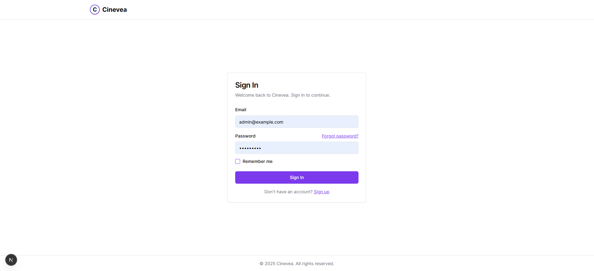
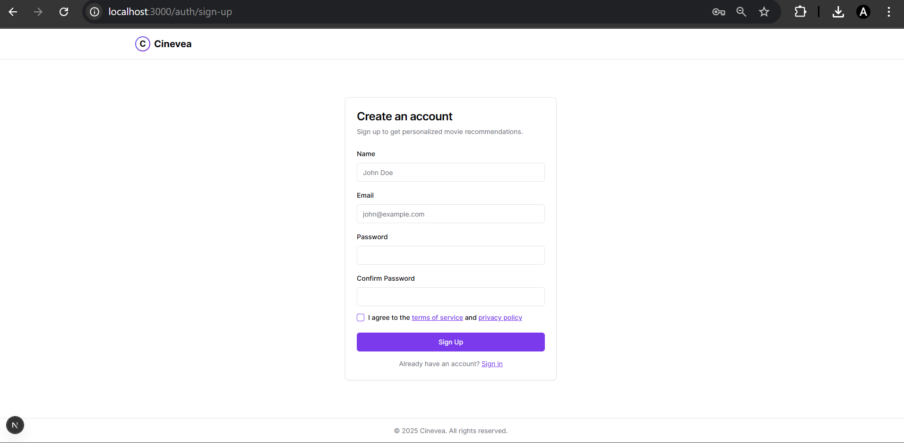
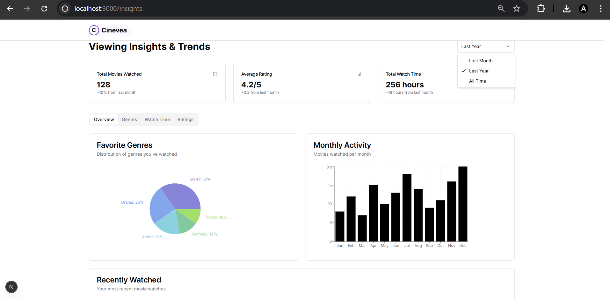
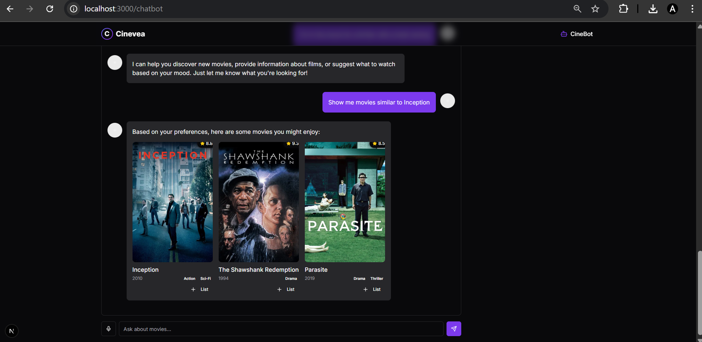
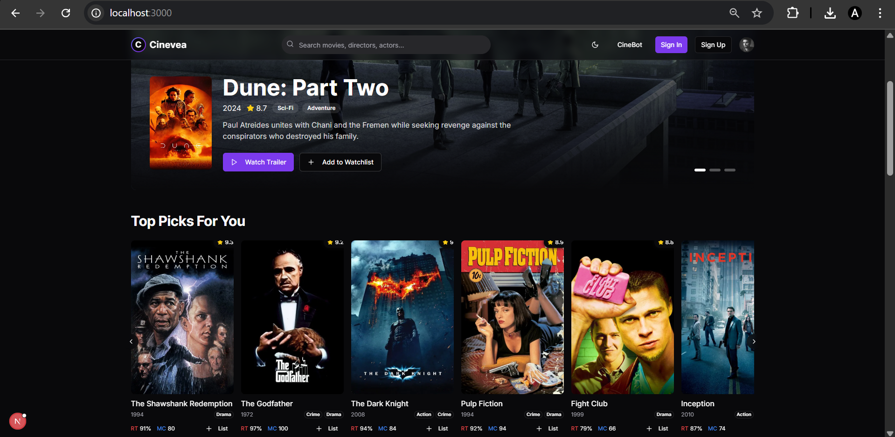

# 🎬 Cinevea - Frontend Movie Recommendation System with Chatbot Integration

Cinevea is a **frontend-only**, sleek, and interactive movie recommendation platform built using **Next.js**, **TypeScript**, and **Tailwind CSS**.  
It simulates a personalized movie discovery experience with viewing insights and an integrated chatbot UI to help you explore films, genres, and watch history.

 **Note:** This is a frontend project. Any data, recommendations, or chatbot responses shown are powered by mock data or frontend integrations — no backend server is included.

---

## 🚀 Features

### 🔐 Authentication (UI Only)
- **Sign Up / Sign In** pages with email and password fields.
- Secure password input with confirmation during registration.
- "Remember Me" option for persistent login sessions.
- "Forgot Password" link for password recovery.
- (Functionality simulated for demo purposes — no real authentication.)

### 📊 Viewing Insights & Trends
- **Total Movies Watched** – Keep track of your viewing count.
- **Average Ratings** – Displays your average rating over time.
- **Total Watch Time** – Monitors the total hours spent watching movies.
- **Favorite Genres Pie Chart** – Visual representation of your most-watched genres.
- **Monthly Activity Bar Graph** – Shows movies watched each month.
- **Recently Watched List** – Quick access to your latest watches.

### 🤖 Chatbot Integration (UI Only)
- Simulated AI-powered **CineBot** for movie recommendations.
- Interactive conversation interface.
- Movie cards with:
  - Poster
  - Title, year, and genres
  - IMDb-style ratings
  - "Add to List" button for saving favorites.

### 🎥 Movie Discovery
- **Top Picks For You** section based on your taste.
- Detailed movie cards with:
  - Poster & year
  - Genres & ratings (Rotten Tomatoes & Metacritic)
  - Watch trailer option
  - Add to Watchlist button.
- Modern dark UI for immersive browsing.

---

## 🛠 Tech Stack

- **Framework**: [Next.js](https://nextjs.org/) (React-based)
- **Language**: TypeScript
- **Styling**: Tailwind CSS + PostCSS
- **Package Manager**: pnpm
- **Charts & Graphs**: Chart libraries for data visualization
- **State/UI Management**: React hooks & custom components

---

## 📷 Screenshots

### Authentication



### Insights & Trends


### Chatbot


### Home Page & Recommendations


---

## 📦 Installation

```bash
# Clone the repository
git clone https://github.com/your-username/cinevea.git
cd cinevea

# Install dependencies
pnpm install

# Run development server
pnpm dev
